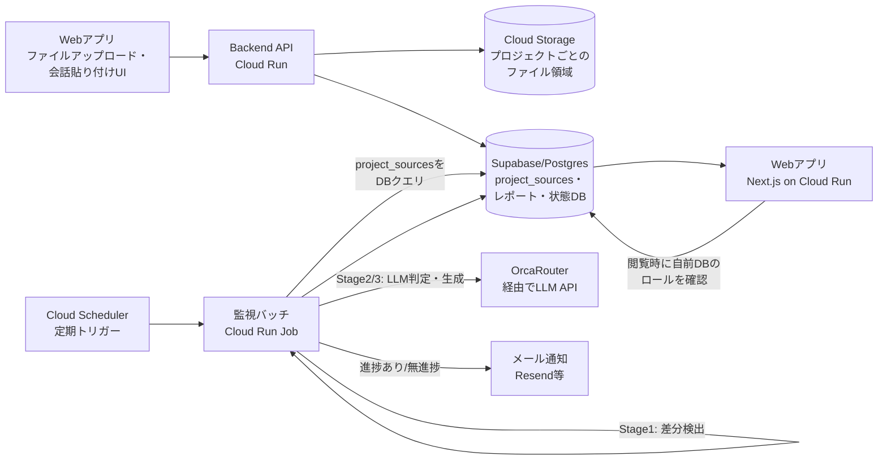
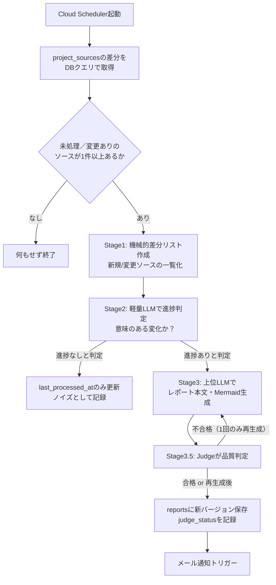

# AIプロジェクト進捗管理エージェント 詳細設計書

2026-09-20

## 1. 概要・背景・目的

### 1.1 解決したい課題
- 複数人が関わるプロジェクトで、AIとの対話・Excel等の資料・進捗状況が個人PCや個別ツールに散在し、「誰が・いつ・何を進めたか」を横断的に把握しにくい
- 上司が部下の進捗を都度能動的に確認する必要があり、進捗報告のための工数（報告する側・受け取る側の両方）が発生している
- 逆に、長期間まったく進捗のないプロジェクトの検知が遅れがちになる

### 1.2 ゴール
- プロジェクト単位のフォルダに対話履歴・作業ファイルを集約し、AIエージェントが定期的（既定1時間ごと）に監視して「意味のある進捗」を自動検出する
- 検出結果を、バージョン管理された読みやすいレポート（Markdown本文＋時系列Mermaid図＋根拠エビデンス付き）として自動生成する
- 進捗があれば関係者へメール通知、一定期間（プロジェクトごとに設定可能）進捗がなければ無進捗アラートを通知する

### 1.3 想定ユーザー
- **プロジェクトメンバー（作業者）**：アプリ内でのファイルアップロード、AIとの対話ログの貼り付け保存
- **管理者・上司**：複数プロジェクトの進捗をレポート経由で横断的に把握。なお、管理者のみ閲覧可（第9.1節）に指定した情報は、一般メンバーのレポート画面上では非表示になる（完全に除外したい情報は、そもそもエージェントの処理対象から外すこともできる）
- **システム管理者**：プロジェクト・メンバー・通知設定・権限の管理

### 1.4 開発体制上の前提
- 本プロジェクトはハッカソン提出物として、数日間の短期開発を想定する
- そのため、MVPスコープ（第11章）を明確にし、一部機能はデモ用に簡略化・シミュレーションで代替する（詳細は各章に明記）

## 2. システム全体アーキテクチャ

### 2.1 全体構成
本システムは、外部サービス（Google Drive等）に依存しない**自己完結型のWebアプリ**として構成する。「Webアプリ（フロント＋API）」と「GCP上で常時稼働する監視バッチ」の2本柱で、ファイルストレージ・DB・認証もすべて自前で用意する。この方針転換の理由は、当初検討していたGoogle Drive連携（OAuth審査、共有ドライブ運用、Drive APIの制約、ブラウザ拡張の配布問題）が、本システムの本質的価値（AIによる進捗判定・レポート生成）とは別のところで開発コストとデモの不安定要素を生んでいたためである（詳細は第9章）。



### 2.2 コンポーネント一覧
| コンポーネント | 役割 | 技術候補 |
|---|---|---|
| Webアプリ（フロント＋API） | ログイン、プロジェクト/メンバー管理、ファイルアップロード・会話貼り付け、レポート閲覧 | Next.js on Cloud Run |
| 監視バッチ | 定期的に`project_sources`の差分をDBクエリで検出し、進捗判定・レポート生成を行う | Cloud Run Job + Cloud Scheduler |
| DB | プロジェクト・メンバー・ソースデータ・レポートを保持 | Supabase（Postgres） |
| ファイルストレージ | アップロードされたファイル（Excel・コード等）の実体 | Google Cloud Storage（プロジェクトごとに`projects/<project_id>/`配下） |
| 認証 | ログイン・ユーザー識別 | Supabase Auth（メール／パスワード、または任意でGoogle等のOAuthログイン） |
| LLM呼び出し | 進捗判定・レポート本文生成 | OrcaRouter経由（モデル選定は第10章） |
| メール送信 | 進捗通知・無進捗アラート | Resend／SendGrid等（ハッカソン向けに即セットアップできるもの） |

### 2.3 認証方式
- ログインは**Supabase Auth**（メール／パスワード、またはマジックリンク）を利用する。DB（Supabase）を既に必須で使うため、追加のセットアップコストがほぼゼロで済む
- 任意で「Googleでログイン」（Supabase AuthのGoogle OAuthプロバイダ）も提供できる。この場合、要求するスコープは基本プロフィール情報のみで、Driveアクセスのような機微なスコープを要求しないため、Googleの追加セキュリティ審査は不要
- ログインしたユーザーは、Supabase Authのユーザー識別子（またはメールアドレス）を通じて`project_members`（第3章）に紐づき、システム上のロール（member/manager/admin）が決まる
- レポート閲覧時の権限確認（第5.3節）は、外部APIを一切呼ばず、この`project_members`のロールと、各情報ソースの可視性設定（`project_sources.visibility`）を自前DBで突き合わせるだけで完結する

### 2.4 ハッカソン向けの簡略化
- Cloud SQLではなくSupabaseを採用し、インフラ構築の手間を最小化する（DB・認証（Auth）が同一プロダクトでまかなえるため、さらに簡略化されている）
- Google OAuth・共有ドライブ・ブラウザ拡張の準備が一切不要になったため、Day1のセットアップ時間が大幅に短縮される（第11.4節）
- 監視バッチの実行間隔は、デモ時は数分に短縮できるよう環境変数で可変にする（本番運用時は1時間を既定値とする）

## 3. データモデル（Supabase / Postgres）

### 3.1 テーブル定義

**projects**
| 列 | 型 | 説明 |
|---|---|---|
| id | uuid PK | プロジェクトID（Cloud Storage上の格納先`projects/<id>/`にもそのまま使う） |
| name | text | プロジェクト名 |
| goal_description | text（必須） | このプロジェクトが何を目指すものかを1〜2文で記述したもの（GitHubリポジトリのDescriptionに相当）。プロジェクト作成時に必須入力とし、Stage2/3のすべてのプロンプトに含めて、LLMが「これはこのプロジェクトに関係する情報か」を判断する軸として使う |
| readme_markdown | text（任意） | goal_descriptionだけでは説明しきれない背景・関係者・詳細な目的を書く自由記述欄（GitHubのREADMEに相当）。空でもよい |
| status | text | active / completed |
| no_progress_threshold_hours | int | 無進捗アラートのしきい値（既定24） |
| exclude_weekends | bool | 営業日ベース判定にするか |
| created_at | timestamptz | |

**project_members**
| 列 | 型 | 説明 |
|---|---|---|
| id | uuid PK | |
| project_id | uuid FK | |
| user_email | text | Googleアカウントのメールアドレス |
| role | text | member / manager / admin（システム独自ロール。本システムには外部サービスの権限体系が存在しないため、これが権限管理の唯一の軸となる） |
| notify_on_progress | bool | 進捗通知を受け取るか |
| notify_on_no_progress | bool | 無進捗アラートを受け取るか |

**project_sources**（ファイル・会話ログを統一的に保持するテーブル）
| 列 | 型 | 説明 |
|---|---|---|
| id | uuid PK | |
| project_id | uuid FK | |
| type | text | `file` / `conversation` |
| filename | text nullable | ファイルの場合のみ。元のファイル名 |
| storage_path | text nullable | ファイルの場合、Cloud Storage上のパス |
| content_text | text nullable | 会話の場合、貼り付けられた本文 |
| content_hash | text | 直近処理時点のハッシュ（Stage1の差分検出に使用。再アップロード・編集の検知にも使う） |
| uploaded_by | text | 登録したユーザーのメールアドレス |
| recorded_at | timestamptz | 実際に作業・会話が行われた日時。ユーザーが任意で指定可能。省略時はアップロード・貼り付け操作を行った時刻を使用する（自前ストレージのため、外部サービス依存時にあった「アップロード時刻と実作業時刻のズレ」問題が構造的に解消される） |
| visibility | text | `all`（プロジェクトメンバー全員に表示） / `managers_only`（manager・adminロールのみ表示、第5.3節） |
| is_excluded | bool | `true`の場合、Stage1以降のいかなる処理にも渡さない＝エージェントの目に一切触れない完全除外（機密情報用、第9.1節） |
| last_processed_at | timestamptz nullable | 監視バッチが最後にこのソースを処理した日時 |
| created_at | timestamptz | |

**reports**（バージョン管理された不変レコード。第5章参照）
| 列 | 型 | 説明 |
|---|---|---|
| id | uuid PK | |
| project_id | uuid FK | |
| previous_report_id | uuid nullable | 1つ前のレポートへの参照（v1→v2→v3の連結） |
| generated_at | timestamptz | |
| kind | text | progress / no_progress_alert |
| judge_status | text | pass / flagged（第4.2節Stage3.5の判定結果。flaggedはWeb画面で「要確認」表示） |
| body_markdown | text | 脚注型エビデンス引用を含む本文（第4〜5章） |
| mermaid_dsl | text | タイムライン図のMermaid定義 |
| evidence_catalog | jsonb | 脚注番号→`project_sources`レコードへの参照のマッピング |

**notifications_log**
| 列 | 型 | 説明 |
|---|---|---|
| id | uuid PK | |
| report_id | uuid FK | |
| sent_at | timestamptz | |
| recipients | text[] | |

**model_calls_log**（PoC・運用コスト監視用、第10章）
| 列 | 型 | 説明 |
|---|---|---|
| id | uuid PK | |
| project_id | uuid FK | コスト集計をプロジェクト単位で行うため、report_idを経由せず直接持たせる |
| report_id | uuid nullable FK | 進捗ありと判定されなかった場合はnull |
| stage | text | stage1 / stage2 / stage3 |
| model | text | 使用したモデル名 |
| latency_ms | int | |
| estimated_cost | numeric | |

**daily_cost_alerts**（コスト上限アラートの重複送信防止用、第4.6節）
| 列 | 型 | 説明 |
|---|---|---|
| alert_date | date PK | 対象日（UTCまたは運用タイムゾーンで統一） |
| triggered_at | timestamptz | しきい値超過を検知した日時 |
| notified | bool | 当日分のアラートメールを送信済みか |

### 3.2 evidence_catalog のJSON構造例
```json
{
  "1": { "source_id": "3f1a...-uuid", "type": "code_diff" },
  "2": { "source_id": "9c2e...-uuid", "type": "sheet_cell", "range": "B12" },
  "3": { "source_id": "7ab0...-uuid", "type": "conversation", "message_index": 42 }
}
```
本文（`body_markdown`）中の `[^1]` 等の脚注番号がこのキーに対応する（第4〜5章）。

**既知の問題（PoCで確認、2026-09-20）**：モデルによっては、脚注が指す`evidence_catalog`の内容と、本文中で実際に引用されている文言が一致しないことがある（原文どおりの引用率がモデルによって0〜8割程度とばらついた）。脚注番号と`evidence_catalog`のキー自体は対応していても、「その根拠を正確に引用しているか」までは保証されない。原文位置（オフセット等）を`evidence_catalog`に持たせて機械的に照合する、または引用部分だけを別途検証するステップの追加を検討する（第12章）。

### 3.3 将来のRAG拡張について
Supabaseはpgvector拡張を標準搭載しているため、将来「過去の全対話・全ファイルを横断検索して要約に使う」設計（第4章のコンテキスト量問題への対応）が必要になった際、既存テーブルに埋め込みベクトル列を追加する形で自然に拡張できる（テーブル再設計は不要）。

## 4. フォルダ監視・進捗判定パイプライン

### 4.1 変更検知（自前ストレージ）
- 監視バッチは、`project_sources`テーブルを直接クエリし、`last_processed_at`が`created_at`または`content_hash`の更新時刻より古い（＝未処理または変更された）レコードを新規・変更分として抽出する
- 外部API（Drive Changes API等）を呼ぶ必要がなく、フォルダ階層のフィルタリングや`md5Checksum`/`modifiedTime`の使い分けといった複雑さも発生しない。自前DBなので`content_hash`と`recorded_at`をそのまま正確に扱える
- `is_excluded=true`のソースは、このクエリの時点で結果から除外し、Stage1以降のいかなる処理にも渡さない（機密情報の完全除外、第9.1節）
- アップロード・貼り付けAPI（第8章）が受け取った時点で`content_hash`を計算して保存しておくため、バッチ側は単純な比較のみでよい
- 処理が完了したソースは`last_processed_at`を更新する

### 4.2 3段階の進捗判定フロー



**Stage1（機械的差分検出・LLM不使用）**
- 新規ファイル／`content_hash`が変化したファイルを列挙するだけ。コストゼロ
- 該当なしなら、この時点で処理終了

**Stage2（軽量LLM判定）**
- Stage1で見つかった変更点（ファイル名、変更前後の内容の抜粋）をまとめて、安価なモデル（第10章）に「これは報告に値する意味のある進捗か」を判定させる
- 出力は構造化JSON（例：`{"is_meaningful_progress": true, "reason": "..."}`）
- 「意味なし」と判定された場合も`last_processed_at`は更新し、同じ変更を次回以降に再度拾わないようにする（例：ファイルを開いただけで保存された、誤字修正のみ、等をノイズとして除外）

**Stage3（本格LLMによるレポート生成）**
- 「進捗あり」の場合のみ実行。1つ前のレポート（`previous_report_id`が指すレコード）の内容を文脈として渡し、「前回から何が進んだか」の差分ナラティブを一貫性を持って生成させる
- **初回実行時（`previous_report_id`が存在しない場合）は「ベースラインモード」で生成する**：比較対象となる前回レポートがないため、差分ナラティブではなく、プロジェクトの目的・現時点で集まっている情報・今後の方向性を整理した内容を書かせる。Stage3のプロンプトは、初回用とそれ以降（差分モード）用の2種類を用意し、`previous_report_id`の有無で出し分ける
- 出力は、Markdown本文（脚注型エビデンス引用、第5.2節の固定見出し構成に従う）・Mermaid DSL・`evidence_catalog`（第3〜5章のデータ構造）

**Stage3.5（Judge：軽量な品質チェック）**
- Stage3の出力に対し、別のLLM呼び出しを1回追加し、固定のルーブリック（RAGやベクトルDBは使わず、プロンプトに直接記述する）に照らして合否判定させる：①決定事項が具体的か（「順調です」等の曖昧な記述はNG）②理由が書かれているか③ボツ案（該当なしを含む）が明記されているか④単なる作業日記になっていないか
- 不合格の場合、Judgeの具体的な修正指示（例：「決定事項が"検索した"だけで、何を選んだかが書かれていない」）を添えてStage3に**最大1回だけ**再生成させる。無限ループを避けるため、それでも不合格なら`reports.judge_status`を`flagged`として保存し、通知はそのまま行うが、レポート上に「要確認」の表示を出す（最終的な品質保証は人間に委ねる）
- 文字数・JSON形式など機械的に判定できるものはLLMを使わずコード側でチェックする（第4.5節の切り詰めルール、脚注カバレッジ等）。Judgeは「論理の一貫性」「日記化していないか」といった定性判断だけに使う

### 4.3 無進捗アラートの判定（Stage2/3とは独立した並行チェック）
- この判定は、第4.2節のStage1〜3の分岐結果によらず、同一のCloud Run Job実行内で、対象の各プロジェクトについて毎回（変更の有無を問わず）評価される
- プロジェクトごとに、直近の`kind=progress`レポートの`generated_at`から現在までの経過時間を計算
- `no_progress_threshold_hours`（`exclude_weekends`設定を考慮）を超えていて、かつ同じ無進捗期間について未通知であれば、`kind=no_progress_alert`のレコードを1件作成し通知する（進捗が再度検出されるまで再通知はしない＝スパム防止）

### 4.4 実行の冪等性について（既知の制約）
Cloud Schedulerの多重起動やリトライにより、同一区間の処理が二重実行される可能性がある。ハッカソン期間では簡易的な「実行中フラグ」による排他制御に留め、本番運用時は分散ロック（例：Postgresのadvisory lock）の導入を推奨事項として第12章に記載する。

### 4.5 Stage2/3への入力コンテキストの切り詰めルール（MVP暫定ルール）
- テキスト系の差分（コード、チャットログ、Markdown等）：変更箇所を中心に前後を含めて**1ファイルあたり最大2,000文字**までに切り詰める（超過分は先頭と末尾を残し中間を省略し、省略した旨をプロンプトに明記する）
- スプレッドシート：Stage1で検出できた変更範囲（セル範囲）がある場合はその範囲のみをCSV化して渡す。検出できない場合は、先頭から最大2,000文字相当の行をCSV化して渡す
- **各ソースの記録日時（`recorded_at`）を、本文中に明記した上でLLMに渡す**（PoCで確認：日時情報を渡さない場合、複数の会話ソースにまたがる状況で「いつ時点の状態を指しているか」が本文中で混在する事例が確認された。第5.2節の「現在地」見出しの精度にも直結する）
- 全体の入力量には`ORCAROUTER_MAX_PROMPT_CHARS`（既定20,000文字）という上限を設ける。PoCでの実測では約1.5万文字で収まったが、プロジェクトが大きくなるとこの上限に達する可能性があり、その場合は本節の切り詰めルールをより厳しく適用する
- 上記はいずれも将来のRAG導入（第3.3節）までの暫定ルールであり、大きなファイルの変更を正確に要約しきれない場合があることを許容する

### 4.6 コスト上限のブレーキ機構（仮実装）
想定外のAPI費用が発生するリスクに備え、簡易的な日次コスト上限を設ける。

- 環境変数 `DAILY_COST_LIMIT_USD`（例：$10）で全プロジェクト合算の日次上限を設定する（プロジェクトごとの個別上限は将来課題、第12章）
- 監視バッチの各実行の冒頭で、`model_calls_log`から当日分の`estimated_cost`を合計し、上限を超えていればその実行ではStage2・Stage3・Stage3.5の呼び出しを**すべてスキップする**（Stage1の機械的差分検出はコストがかからないため実行してよい）
- 上限超過を検知した日について、`daily_cost_alerts`（第3.1節）でその日まだ通知していないかを確認し、未通知であれば環境変数 `SYSTEM_ALERT_EMAIL`（システム管理者のメールアドレス）宛に「本日のLLM利用コストが上限に達したため、進捗判定を停止しました」という警告メールを1通だけ送る（`notified`を`true`に更新し、同日中の再送を防ぐ）
- 翌日になれば自動的に集計がリセットされ、通常運転に戻る（`daily_cost_alerts`は日付ごとに新規行が作られる想定）
- これはあくまで仮実装であり、プロジェクト単位の上限設定・管理画面からの動的変更・Slack通知等は将来の拡張とする（第12章）

## 5. レポート生成・バージョン管理・権限に応じた動的表示

### 5.1 バージョン管理の考え方
- `reports`テーブルの各行は**不変（イミュータブル）**。生成後に内容が書き換わることはない
- `previous_report_id`で1つ前のレポートに連結し、v1→v2→v3…という時系列を構成する
- Webアプリのレポート一覧画面は、この連結を辿って時系列に並べて表示する。過去のバージョンもいつでも開ける（上書きされない）
- 最初に生成されるレポート（`previous_report_id`が`null`）は「ベースラインレポート」であり、差分ではなくプロジェクトの目的と初期状態を整理する内容になる（第4.2節のベースラインモード参照）

### 5.2 本文フォーマット：Markdown＋脚注型エビデンス引用
第4章Stage3で生成される`body_markdown`は、根拠を示したい箇所に`[^1]`のような脚注番号を挿入する形式とする（第3.2節の`evidence_catalog`参照）。

**本文の見出し構成は固定する（自由記述はやめる）**。「試行錯誤や調査ログをそのまま垂れ流す作業日記」になることを防ぐため、見出し自体は固定し、各見出しの中身の書き方（文章・箇条書き・表など）だけをLLMが状況に応じて工夫する方式にする。

- 差分モード（`previous_report_id`が存在する場合）の固定見出し：
  1. 今回決定したこと
  2. その理由
  3. 検討したが採用しなかった選択肢（該当なしならその旨を明記する）
  4. 次にやること・未解決の論点
  5. 現在地（PoCで追加。プロジェクト全体として今どの段階にいるかを一言で示す。これが抜けると、複数の会話ソースをまたいだ際に「いつ時点の状態を指しているか」が本文中で混在しやすいことがPoCで確認されたため）
- ベースラインモード（第4.2節、初回実行時）の固定見出し：
  1. プロジェクトの目的
  2. 現時点の状況（以下3点を必ず含める。PoCでこの粒度が実際に機能することを確認済み）
     - これまでの進め方と流れ
     - 現在地
     - 現時点の結論（決定事項とその理由、ボツ案）
  3. 今後の方向性

Stage3のプロンプトには、`goal_description`（第3.1節）を毎回含めるとともに、「調査・試行錯誤のログ（例：〜を検索した、〜を試した）と、意思決定のログ（例：〜を採用した、〜という理由で却下した）を区別し、後者を優先して書け」という指示を明記する。

### 5.3 閲覧時の権限フィルタ（動的出し分け）
**方式：自前DB内の`project_members.role`と`project_sources.visibility`を突き合わせるだけ（外部APIを一切呼ばない）。**

1. ユーザーがレポートを開くと、Webアプリは`body_markdown`中の脚注番号を`evidence_catalog`と突き合わせ、参照されている`source_id`の一覧を洗い出す
2. それぞれの`source_id`について、`project_sources.visibility`を確認する：`all`なら誰でも閲覧可、`managers_only`なら閲覧者の`project_members.role`が`manager`または`admin`かどうかを確認する
3. アクセス不可と判定された脚注は、本文中の参照リンクを「権限がありません」という表示に置き換える（脚注番号を含む地の文自体は残すが、根拠へのリンク・引用元の詳細だけを隠す。文章そのものを部分的に書き換えることはしない）
4. これらはすべて自前DBへの単純なJOINクエリで完結するため、外部APIのレート制限・TTLキャッシュ・並列化といった対策が一切不要（旧設計でDrive APIのライブチェックのために必要だった仕組みがまるごと不要になる）

この方式は、外部の権限モデルに依存しないため、**外部サービスへの広範なアクセス権限（Driveスコープ等）を一切要求しない**という利点がある。旧設計（Google Drive連携）で検討していた「Drive共有権限をそのまま使う」方式・「機密フォルダを完全除外する」方式のどちらとも異なり、**自前のロール・可視性設定だけで完結する**シンプルな仕組みに置き換えた。

### 5.4 Mermaidタイムライン図との連携
`mermaid_dsl`のノードIDは`evidence_catalog`の脚注番号と対応させる。ノード自体の表示要否も5.3と同様のロジックで判定し、閲覧者がアクセスできないエビデンスしか持たないノードは、タイトルのみ残すかノード自体を灰色表示にする（詳細は第6章）。

### 5.5 アーカイブ・エクスポート（将来対応）
監査等で「この瞬間の見え方」を固定保存したいニーズが出た場合は、閲覧者の権限確定後にPDF等へエクスポートする機能を追加できる（第12章オープン課題）。ハッカソンのMVPスコープには含めない。

## 6. Mermaidタイムライン図とホバーエビデンス表示

### 6.1 描画方式
- レポート閲覧画面（Next.js）で、クライアントサイドの`mermaid.js`を用いて`mermaid_dsl`をSVGとして描画する
- サーバー側は、第5.3〜5.4節の権限フィルタを通した**閲覧者ごとのDSL**を都度生成してクライアントに渡す（全員共通の1つのDSLをキャッシュして使い回すことはしない）

### 6.2 ホバーでエビデンスを見せる仕組み
1. 各Mermaidノードには、`evidence_catalog`の脚注番号に対応する`id`属性を付与しておく
2. 描画後、JS側で各ノードのDOM要素にマウスオーバーイベントを付与し、対応するエビデンス情報（種類・抜粋・元ファイルへのリンク）をツールチップとして表示する
3. **重要**：閲覧権限がないエビデンスの中身は、そもそもサーバーからクライアントに送信しない（CSSで隠すだけの実装は、ブラウザの開発者ツールで中身が見えてしまうため不可）。権限のないノードは、ツールチップに「この情報を見る権限がありません」とだけ表示し、ノード自体も見た目上区別できるようグレーアウト・破線枠にする

### 6.3 元ファイルへのリンク
- コード／会話ログ：アプリ内のソース詳細画面を開くリンク（`storage_path`のファイルをダウンロードまたはテキストをその場で表示）
- スプレッドシート：可能な範囲でセル範囲をテキストとして本文中に併記する（外部Deep Linkは使えないため、アプリ内プレビュー画面で該当範囲をハイライトする程度に留める）
- 上記が難しい形式（PDF等）は、ファイルを開くリンクのみに留める

### 6.4 ハッカソンでの実装範囲
- Mermaidの描画とホバーツールチップ自体はMust（デモの目玉機能）
- スプレッドシートのセル単位ハイライトは可能なら対応、間に合わなければファイルを開くリンクに簡略化する

## 7. 通知設計

### 7.1 進捗通知メール
- トリガー：第4章Stage3でレポート（`kind=progress`）が生成されるたび
- 宛先：`project_members`のうち`notify_on_progress=true`のメンバー
- 本文：レポート冒頭の要約（2〜3文程度）のみを記載し、詳細はWebアプリへのリンクとする（フルレポートを本文に含めない理由：閲覧者によって見える範囲が異なる第5章の権限フィルタは「クリックしてWebアプリを開いた瞬間」に適用される設計のため、メール本文の時点で個別に権限判定した内容を作り込むと実装が複雑になる。リンク方式ならこの問題を避けられる）
- 件名例：`【<プロジェクト名>】進捗更新：<要約1行>`

### 7.2 通知の粒度
- 第4章の設計上、1回の監視サイクルで検出された変更はStage3でまとめて1件のレポートとして生成される。したがって**基本的に「1レポート＝1通のメール」**となり、追加のまとめ処理は不要
- ただし、デモ等で監視間隔を数分単位に短縮する場合、短時間に複数のレポートが生成されメールが多発する可能性がある。将来的な改善案として「一定時間分の複数レポートをダイジェストとして1通にまとめる」モードを追加できるよう設計上の余地を残す（MVPでは実装しない）

### 7.3 無進捗アラート
- トリガー：第4.3節の判定により`kind=no_progress_alert`のレコードが生成されたとき
- 宛先：既定では**管理者・上司ロール（manager/admin）のメンバーのみ**に送る（「部下の進捗が止まっていることに気づく」というユースケースの中心的な通知のため）。一般メンバー（member）は`notify_on_no_progress`を個別にONにした場合のみ受け取る
- 本文：「〈プロジェクト名〉で〈しきい値〉時間、進捗が確認されていません」という定型文＋プロジェクトへのリンク
- 同一の無進捗期間について再通知はしない（進捗が検出されてリセットされるまで1回のみ）

### 7.4 送信基盤
- ハッカソン期間中のセットアップ速度を優先し、Resend等のメールAPIを採用する（Gmail APIのドメイン全体委任は管理者コンソールでの設定が必要でセットアップに時間がかかるため、本番移行時の検討事項とする）

## 8. 会話・ファイル追加機能（アプリ内蔵）

### 8.1 提供形態
- ブラウザ拡張は使用せず、Webアプリ画面内の「＋情報を追加」ボタンから、ファイルアップロード・会話貼り付けの両方を行う
- 拡張機能特有の懸念（DOMセレクタの保守、Manifest V3対応、Chromeウェブストア審査・配布方法）が一切発生しない
- 将来的にワンクリック自動キャプチャ（旧設計のブラウザ拡張に相当する機能）を追加したくなった場合も、同じ登録APIを呼ぶだけで済むように設計しておく（第12章）

### 8.2 ファイルアップロード・会話貼り付け機能

**対応方式（2種類）**
1. **ファイルアップロード（Must）**：ドラッグ&ドロップまたはファイル選択で、Excel・コード・PDF等をアップロードする。保存先はCloud Storageの`projects/<project_id>/`配下
2. **会話貼り付け（Must）**：ChatGPT・Claude.ai等でのやり取りをコピーし、専用のテキストエリアに貼り付けて送信する。特定サービスのDOM構造に依存しないため、どのAIツールの会話でも同じ方法で使える

**操作フロー**
1. ログイン後、プロジェクト画面で「＋情報を追加」を押す
2. 「ファイル」または「会話」のいずれかを選び、ファイルを選択（またはドラッグ&ドロップ）するか、会話テキストを貼り付ける
3. 実際に作業・会話が行われた日時（`recorded_at`）を任意で指定する。省略した場合はこの操作を行った時刻がそのまま使われる
4. 「全員に公開」または「管理者のみ」の可視性（`visibility`）を選ぶ
5. Webアプリはバックエンドの登録APIに`{project_id, type, content または file, recorded_at, visibility}`を送信し、`project_sources`に新規レコードとして保存する

**記録日時の扱い**：`recorded_at`はユーザーが操作を行った時点で正確に記録される（上記手順3参照）。外部ストレージ経由のアップロード時刻と実作業時刻がズレる問題は、自前で登録APIを持つことで構造的に発生しない。

### 8.3 将来の拡張：ブラウザ拡張による自動キャプチャ（任意）
- 現行MVPでは、会話は手動貼り付け（第8.2節）で十分機能する。将来「ワンクリックで自動送信したい」というニーズが出た場合は、Chrome拡張を追加開発し、第8.2節と同じ登録APIを呼ぶだけで実現できる（バックエンドの変更は不要）
- ブラウザ全体の閲覧・検索履歴を自動収集する機能（旧設計で検討していたもの）も、同様に将来の拡張として位置づける。プライバシー配慮（同意画面、記録中の視覚的表示）の設計思想は維持する
- 拡張機能を追加する場合の配布方法（Chromeウェブストアの非公開登録、またはGoogle Workspaceのエンタープライズポリシーでの強制インストール）は、必要になった時点で検討する（第12章）

### 8.4 ストレージと可視性設定
- ファイルはCloud Storageの非公開バケットに保存し、直接の公開URLは発行しない。閲覧はWebアプリ経由の署名付きURL（有効期限付き）でのみ許可する（第9.4節）
- 誰が登録したかは、ログイン中のユーザー（Supabase Auth）のメールアドレスを`project_sources.uploaded_by`にそのまま記録することで担保する
- 可視性（`visibility`）と完全除外（`is_excluded`）は、登録時にユーザーが選択する（第8.2節の手順4）。後から変更することも可能とする

### 8.5 プライバシー対応
- 会話を貼り付ける操作自体がユーザーの能動的な行為であるため、旧設計のブラウザ拡張で必要だった「同意画面」「記録中の視覚的表示」は必須ではなくなる（意図せず記録され続けるリスクがそもそも存在しない）
- 将来、第8.3節の自動キャプチャ拡張を追加する場合は、その時点で同様の同意・視覚的表示の仕組みを設ける

## 9. セキュリティ・機密情報管理方針

### 9.1 アクセス制御の考え方（再掲・整理）
本システムは外部の権限モデルを持たないため、権限管理は自前DBの2軸だけで完結する。

- **システム上のロール**（`project_members.role`）：誰が管理者/上司かを決め、通知の宛先や管理画面の操作権限、`managers_only`情報の閲覧可否を決める（第3章）
- **情報ソースの可視性・完全除外**（`project_sources.visibility`・`is_excluded`、第3.1・4.1節）：登録時にユーザーが選択する。`is_excluded`を指定すれば、Stage1以降のいかなる処理にもその中身は渡らず、レポート上には一切反映されない
- 外部サービス（Google Drive等）への広範なアクセス権限を要求しないため、そもそも「外部の権限とシステム内の権限をどう整合させるか」という問題自体が発生しない。これは旧設計（第5.3節参照）からの明確な簡略化であり、セキュリティレビューの負荷を下げる効果もある

### 9.2 外部LLMへのデータ送信について
- OrcaRouter経由で外部LLMプロバイダにプロジェクトの内容（会話ログ・ファイル内容の抜粋）を送信することになる。ハッカソン期間中は、実在の機密情報ではなくデモ用データで検証することを強く推奨する
- **OrcaRouter自体はデフォルトでゼロデータリテンション（Zero Data Retention）**：プロンプト・応答の内容はメモリ上で中継されるのみで、OrcaRouterのサーバー上にディスク保存されない（保持されるのはタイムスタンプ・トークン数・レイテンシ等のメタデータのみ）。ただし、これは**OrcaRouter自身の層に限った保証**であり、実際にリクエストが転送される先（OpenAI・Anthropic・Google等の各プロバイダ）は、それぞれ自社のポリシーに基づいてデータを保持する（例：不正利用検知目的で数十日程度）。また、OrcaRouterには任意でオンにできる「リクエストログのキャプチャ」機能があり、これを有効化するとプロンプト・応答の実文が保存されるため、**本番運用では常にオフのままにする**
- 上記は技術的なデータ取り扱いの一部を軽減する材料ではあるが、**利用規約・プライバシーポリシー・データ保持方針の法務確認や、必要に応じたセキュリティ監査の代わりにはならない**。ハッカソン後に本番運用へ進める場合は、別途この観点でのレビューを行う
- 本番運用移行時は、送信先プロバイダのデータ保持・学習利用ポリシーを確認し、必要に応じてゼロリテンション契約のあるプロバイダを優先する、または送信前に機密情報をマスキングする仕組みを追加検討する（第12章オープン課題）

### 9.3 秘密情報の管理
- OrcaRouter APIキー、Supabase接続情報・サービスロールキー、メール送信APIキー等は、すべてGoogle Cloud Secret Managerで管理し、Cloud Runの環境変数として注入する（コードやリポジトリに直書きしない）
- Cloud Storageバケットへのアクセスは、Cloud Runのサービスアカウントに限定し、バケット自体は非公開設定とする（第9.4節）

### 9.4 アップロードデータの取り扱い
- Cloud Storageバケットは非公開設定とし、ファイルへのアクセスは署名付きURL（有効期限付き）経由のみに限定する
- アップロードできるファイルサイズ・拡張子に上限を設ける（ハッカソンのMVPでは簡易なチェックで可）
- Webアプリ・APIとの通信はHTTPSのみ

### 9.5 監査ログ（将来拡張）
- `notifications_log`・`model_calls_log`は、誰にいつ何を通知したか／どの処理にAIを使ったかの最低限の記録として機能する
- 「誰がいつどのレポートを閲覧したか」までの詳細な閲覧監査ログは、ハッカソンのMVPスコープには含めない（第12章に将来課題として記載）

## 10. モデル選定・OrcaRouter利用方針・PoC計画

### 10.1 OrcaRouterについて
OrcaRouterは、OpenAI互換のAPIゲートウェイであり、`base_url`を`https://api.orcarouter.ai/v1`に向けるだけで、OpenAI・Anthropic・Google等200以上のモデルに単一のインターフェースでアクセスできる。プロバイダへの実費のみの課金（マークアップなし）で、`orcarouter/auto`を指定するとプロンプトの難易度を自動判定して最適なモデルに振り分けてくれる機能もある。

### 10.2 候補モデル
| 候補 | 特徴 | 想定用途・PoC結果（2026-09-20実施、`info/`2ファイル・単一プロジェクトでの暫定結果） |
|---|---|---|
| `qwen/qwen3.7-flash` | 低コスト・高速寄り | **暫定推奨（Stage2・Stage3とも）**。固定見出しを満たし、脚注と`evidence_catalog`の対応も一致。引用の原文一致率はbaseline 9/11・diff 13/16。レイテンシ87〜104秒、コスト約0.0014ドル/回 |
| `openai/gpt-4.1-mini` | 高速 | 固定見出しは満たすが、脚注マーカーと`evidence_catalog`が**不一致**、引用の原文一致率もdiffで0/13と低い。baselineでは「現在地」に複数時点の状態が混在する事例あり。レイテンシ20〜22秒、コスト約0.0095ドル/回 |
| `orcarouter/auto` | プロンプトごとに自動でモデルを選定 | **PoCで除外**：`info/`規模（約7,000トークン）の入力で、推論が出力上限を使い切り本文が空になる事象が4回中4回発生。長文入力には現時点で不向き |
| Union Alpha | 無料枠モデル（想定） | **未検証**：PoC実施時点でモデル一覧にIDが見つからず、このアカウントでは利用不可だった。Stage2の安価モデル候補として別途要確認 |
| 中堅の有料モデル（1つ選定） | 品質重視 | 上記`gpt-4.1-mini`のPoC結果を踏まえ、他の候補と比較する余地あり |

上記はPoC結果報告（`poc_report.md`）に基づく。1プロジェクト・各条件1回の実行結果であり、`summary.csv`相当の人力採点も未実施のため、**結論は暫定**（第10.3節）。

### 10.3 PoC計画（半日程度を想定）
1. **テストケースを5〜6個準備**：些細な変更（進捗なしと判定すべき）、Excelの数値更新、コードのコミット、AIとの議論ログ等、判定させたい代表パターンを用意する
2. **同一プロンプトで各候補モデルに投げる**：第4章Stage2用のプロンプト（進捗判定）と、Stage3用のプロンプト（Markdownレポート生成）をそれぞれ用意し、候補モデルごとに実行する
3. **手動採点**：「進捗判定の正しさ」「Markdown要約の読みやすさ・的確さ」を5段階で評価し、レイテンシとコスト（`model_calls_log`に記録、第3章）も記録する
4. **意思決定**：Stage2は速度・コストを重視して最も安価で十分な精度のモデルを採用、Stage3は品質を重視して評価が最も高かったモデルを採用する。`orcarouter/auto`が両ステージで十分な精度を出せる場合は、モデル管理の手間を減らすためそちらに寄せることも検討する

**2026-09-20実施のPoC結果（暫定）**：Stage2・Stage3とも`qwen/qwen3.7-flash`を暫定採用とする（第10.2節）。`orcarouter/auto`は長文入力（約7,000トークン）で出力上限に達し失敗したため除外、Union Alphaはこのアカウントで利用不可のため未検証。この結果は1プロジェクト・各条件1回の実行に基づく暫定値であり、`summary.csv`相当の人力採点（判定の正しさ・要約の質のスコア付け）は未実施。**追加のテストケース・人力採点を行ってから最終決定とする**

### 10.4 実装上の注意
- Stage2・Stage3ともに、出力は構造化JSON（第4章参照）で受け取る。プロンプト内で厳密なJSON形式を指示し、パース失敗時のリトライ処理を実装する
- モデル名は環境変数化し、PoCの結果やコスト状況に応じてコード変更なしで切り替えられるようにする

## 11. ハッカソンスコープと開発優先順位

### 11.1 Must（コアループ＋デモの目玉）
- 自前ストレージへのファイルアップロード・会話貼り付け機能（第8章）
- 2段階LLM判定＋Markdownレポート生成（第4章）
- 固定見出し構成＋軽量Judge（Stage3.5）による品質チェック（第4.2・5.2節）
- コスト上限のブレーキ機構（仮実装、第4.6節）
- レポート履歴（v1, v2, v3…）のWeb表示（第5章）
- 権限に応じた表示切り替え（2〜3アカウントで実演、第5.3節）
- Mermaidタイムライン＋ホバーエビデンス（第6章）
- メール通知（最低1通、実際に送信できること、第7章）

### 11.2 Should（時間があれば）
- 無進捗アラート（第7.3節）
- ブラウザ拡張による自動キャプチャ（将来のオプション機能、第8.3節）

### 11.3 Cut（今回は見送り、設計書上は構想として残す）
- ブラウザ全体の閲覧・検索履歴の記録機能（第8.3節の仕様は設計上残すが、実装優先度は最下位）
- Excel/PDFのセル単位・厳密な差分抽出（簡易的なテキスト抽出・`content_hash`比較で代替、第4.1節）

### 11.4 開発の進め方（目安：数日）
| 日程目安 | やること |
|---|---|
| Day1 | インフラ構築（Supabase DB＋Auth設定、Cloud Storageバケット作成、Cloud Run雛形）※Google OAuth・共有ドライブ設定が不要になった分、大幅短縮、DBスキーマ作成（第3章）、ファイルアップロード・会話貼り付けAPI実装（第8章） |
| Day2 | Stage2/3のLLMパイプライン実装とPoC（第10章）、`reports`テーブルへの保存、Webアプリの基本的なレポート一覧・詳細表示 |
| Day3 | Mermaid＋ホバー実装（第6章）、権限に応じた表示切替実装（第5.3節、自前DBベースなので軽量）、メール通知実装（第7章） |
| Day4（バッファ） | デモ用データ投入、通し確認・デモ練習（ブラウザ拡張開発が不要になった分、余裕を確保） |

### 11.5 プロジェクト完了時の扱い
- `projects.status`を`active`から`completed`に変更する操作をWebアプリの管理画面に用意する
- `completed`のプロジェクトは、監視バッチの対象から除外する（変更検知・LLM呼び出し・通知のいずれも発生しない）
- 過去に生成済みのレポートは`completed`後も引き続き閲覧可能（第5章のバージョン管理により保持され続ける）

## 12. 未決事項・今後の拡張ポイント

本設計書の作成過程で「今回は見送るが、将来検討すべき」と位置づけた項目を一覧化する。

| 項目 | 内容 | 関連章 |
|---|---|---|
| 監視バッチの冪等性強化 | Postgresのadvisory lock等による多重実行防止（本番運用時） | 4.4 |
| RAG/ベクトル検索の導入 | プロジェクト長期化時のコンテキスト量問題への対応。Supabaseのpgvectorで拡張可能 | 3.3 |
| ブラウザ拡張による自動キャプチャの追加 | ワンクリック送信・閲覧履歴の自動収集を、将来オプション機能として追加する（第8.3節） | 8.3, 11.2, 11.3 |
| Excel/PDFのセル単位差分抽出 | 現状は`content_hash`比較に留まる。より粒度の細かい差分抽出への対応 | 4.1, 11.3 |
| レポートの固定スナップショット・エクスポート | 監査目的で「その瞬間の見え方」をPDF等に固定保存する機能 | 5.5 |
| 送信データのマスキング/DLP | 外部LLMに送る前に機密情報を検出・マスキングする仕組み | 9.2 |
| 詳細な閲覧監査ログ | 「誰がいつどのレポートを見たか」までの記録 | 9.5 |
| 通知のダイジェスト化 | 短時間に複数レポートが生成された場合に1通へまとめるモード | 7.2 |
| 対応AIチャットツールの拡大 | 会話貼り付け機能自体はツール非依存だが、将来の自動キャプチャ拡張（第8.3節）ではChatGPT/Claude以外への対応も検討 | 8.2, 8.3 |
| Gmail API等への送信基盤移行 | 本番運用時、Google Workspaceのドメイン全体委任を用いた送信への切り替え | 7.4 |
| コスト監視アラート | 日次の全体上限は第4.6節で仮実装済み。プロジェクト単位の個別上限、管理画面からの動的な上限変更、Slack等への通知チャネル追加は今後の拡張 | 3.1, 4.6, 10.4 |
| エージェントの自律性強化 | Stage2/3を固定パイプラインではなく、LLM自身が追加情報の要否を判断してツールコールする設計への拡張。チーム内で別途方針を検討中のため、今回は現行の3段階パイプライン（第4.2節）のまま据え置く | 4.2 |
| 脚注引用の原文一致率が低い問題（PoCで確認） | モデルによっては、`evidence_catalog`が示す根拠と本文中の引用文言が一致しないことがある（原文一致率がgpt-4.1-miniのdiffモードで0/13等）。原文位置の機械的な照合、または引用検証ステップの追加を検討する | 3.2, 10.2 |
| `orcarouter/auto`が長文入力で失敗する問題（PoCで確認） | 約7,000トークンの入力で、推論が出力上限を使い切り本文が空になる事象が4回中4回発生。長文対応のモデル選定または入力の事前圧縮が必要 | 10.2 |
| Union Alpha（無料モデル）の利用可否確認 | PoC実施時点でモデル一覧にIDが見つからず、このアカウントでは利用できなかった。Stage2の安価モデル候補として別途要確認、または`qwen/qwen3.7-flash`等への置き換えを検討 | 10.2 |
| Judgeの再生成が原文にない記述を増やすリスク（PoCで確認） | 別実行で、Stage3.5の再生成によってソースに無い記述が増える例が確認された。再生成後の出力にも脚注カバレッジ等の機械チェックを適用する必要がある | 4.2 |
| モデル選定の人力採点が未実施 | PoCの`summary.csv`相当の人力採点（判定の正しさ・要約の質）が未入力のため、第10.2・10.3節のモデル選定は暫定。追加のテストケースでの検証が必要 | 10.2, 10.3 |
| ファイルアップロードの大容量対応 | 大きなファイルの直接アップロード（resumable upload等）への対応。ハッカソンのMVPでは簡易な単純アップロードで十分とする | 8.2 |
| 自前ストレージのデータ持ち出し・バックアップ方針 | Google Driveのような外部サービス依存時は利用者自身が元データを保持できたが、自前ストレージではサービス終了時等のデータエクスポート手段を別途用意する必要がある | 2.1, 8.2 |

以上が現時点での詳細設計内容である。本書の内容は、開発の進行に伴い実装上の制約が判明した際には随時見直すことを前提とする。
