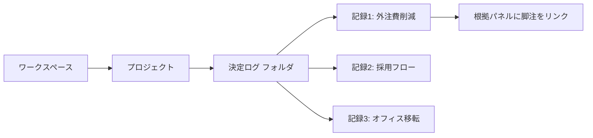

# 決定ログ UI改善 設計仕様書

2026-09-22 · 相方

現行UIは記事ページ的な単一カラム構成のため、階層感とAI生成箇所の区別が伝わりにくい。本書はモックアップ（3カラム: ディレクトリツリー / 本文 / 根拠パネル）の構造を実装可能な形で定義する。

## 画面構成

1440×940pxを基準としたデスクトップ3カラムレイアウト。

| 領域 | 幅 | 役割 |
| --- | --- | --- |
| 左: ディレクトリツリー | 264px 固定 | ワークスペース内のプロジェクト・フォルダ・個別記録をツリー表示。現在開いている記録をハイライト |
| 中央: 文書ビュー | 可変（残り幅） | パンくず・メタデータ・タイトル・AI要約・原本ソース一覧を縦積み表示。スクロール領域 |
| 右: 根拠パネル | 320px 固定 | 検索ボックス、選択中の脚注に対応する原文引用、記録のメタ情報 |

ツリーは折りたたみ可能なフォルダ階層とし、各記録には版数・更新日をサブテキストで添える。

## コンポーネント仕様

### 1. ディレクトリツリー（左サイドバー）

- ワークスペース名 → プロジェクト → フォルダ（例: 決定ログ）→ 記録、の4階層。フォルダは開閉可能なアコーディオン。
- 各記録行: ドキュメントアイコン、タイトル（1行省略表示）、版数・更新日のサブテキスト。現在表示中の記録は背景色と枠線で選択状態を表す。
- フッターに件数表示（例: 「全4件」）。

### 2. パンくず＋メタデータ行

- パンくず: `決定ログ / <プロジェクト名>`。
- チップ群: 版数（グレー）、ステータス（要確認＝オレンジ系、承認済み＝グリーン系など状態ごとに配色を分ける）、NEW件数（グリーン）。右端に最終更新日時。

### 3. タイトル

- サンセリフ、28〜32px、記事見出しのような大型明朝は使わない。最大幅を720px程度に制限し可読性を確保。

### 4. AI要約ブロック

- アイコン（AIを示す装飾、絵文字は使わない）＋ラベル「AIによる自動要約 — n件の会話ログとm件の資料から生成」を本文の上に必ず表示。
- 本文は地の文と視覚的に区別する背景色または枠を付け、他の手動記述セクションと混同しないようにする。
- 文中の脚注番号（\[1\]\[2\]…）はクリック可能とし、右の根拠パネルに対応原文をスクロールなしで表示する。

### 5. 原本ソース一覧

- Google Drive風のファイル行: ファイル種別アイコン、ファイル名、更新日。クリックで「資料」タブの該当ファイルを開く。
- 除外されたソース件数（個人的な内容／機密情報／無関係な内容／その他の内訳）を一覧の下に小さく表示。

### 6. 根拠パネル（右）

- 上部: 出来事検索ボックス（2文字以上でインクリメンタル検索）。
- 選択中の脚注に対応する原文引用カード（出典ファイル名・タイムスタンプ・引用テキスト）。
- 下部: 「この記録について」— 生成元（ログ件数・資料件数）、最終更新、ステータスをラベル・値の2列で表示。

## データモデルと状態

| 要素 | 参照データ | 備考 |
| --- | --- | --- |
| ツリー項目 | プロジェクトID、フォルダID、記録ID、タイトル、版数、更新日時、選択状態 | 選択状態は現在のルート（表示中の記録ID）と一致するかで判定 |
| メタデータチップ | 版数、ステータス（enum: 検査中／要確認／承認済みなど）、NEW件数、最終更新日時 | ステータスは色分けされたenumとして管理し、値の追加に備える |
| AI要約ブロック | 生成元ログ件数、生成元資料件数、要約本文（脚注参照付きMarkdownまたはリッチテキスト） | 脚注番号は根拠データの配列インデックスに対応させる |
| 脚注／根拠 | 脚注ID、出典ファイルID、出典内タイムスタンプ、引用テキスト | 本文中のクリックで根拠パネルの表示対象を切り替える（パネル自体の再読み込みは不要） |
| 原本ソース一覧 | ファイルID、ファイル種別、ファイル名、更新日、除外理由の集計（個人的な内容／機密情報／無関係な内容／その他） | 「資料」タブ内の実ファイルへのディープリンクを保持 |
| 根拠パネル | 選択中の脚注ID（未選択時はプレースホルダー文言を表示）、検索クエリ、記録メタ情報 | 検索は2文字以上でトリガー |

状態遷移としては、根拠パネルは「未選択」→「脚注クリックで該当根拠を表示」の2状態のみを持つ。ツリー側は「折りたたみ／展開」×「選択中／非選択」の組み合わせで記録される。

## 実装への申し送り事項

- 参考モックアップ: [決定ログ UI改善案](https://claude.ai/artifact/Ac5DXqeNhSee9xKU62A3YW)（サイドバー＋本文＋根拠パネルの3カラム構成を実際のレイアウトで確認可能）。
- 既存のフロントエンド実装（コンポーネントファイルやスタイル定義）をこの仕様書とあわせてClaude Codeに読み込ませ、差分実装として進めるのが効率的。
- 優先順位案: (1) タイトルのタイポグラフィ縮小とチップ化 → (2) AI要約ブロックの視覚的分離 → (3) 左サイドバーのツリー化、の順で段階的にリリース可能。ツリー化は既存のフォルダ/記録データ構造をAPIから取得できるか確認が前提。
- 未確定事項: ステータスの色分けルール（何色が「要確認」「承認済み」等に対応するか）と、ツリーの最大階層数は、既存のデータモデルに合わせて決定する必要がある。
