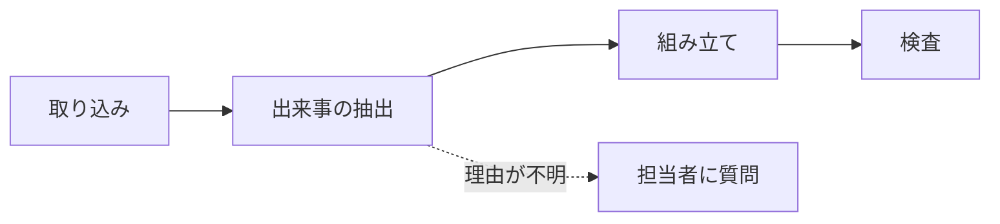

# 記事（docs/article.md）の事実確認と修正案

確認日：2026-09-22。照らした実装：`feature/impl-core` の `2c75616`（worker・web）と、デプロイ先の設定。
冒頭2章（体験談・課題）は対象外。食い違いのある記述だけを挙げる。

**反映の方針（2026-09-22 決定）**：45・51行目の「置いておくだけ」は説明としてそのまま残し、末尾の但し書きで「今回は時間の関係で実装せず、アップロード形式」と補う。記事に無かった機能のうち、エージェントの追加調査と質問・出どころの印の補正・却下案の再浮上の警告・無進捗の通知の4つを、「作ったもの」の章に1文ずつ足す。それ以外は下の表の直し方のとおり docs/article.md に反映済み。

## 1. 事実確認（食い違いのある記述）

| 行 | 記事の記述 | 実際の実装 | 直し方 |
|---|---|---|---|
| 45 | 「プロジェクトを立ち上げて、そこにファイル（…）を置いておくだけのツール」 | ファイルを置く場所（フォルダ）は無い。アプリの画面で会話を貼り付けるか、ファイルをアップロードする | 反映せず（説明はそのまま、末尾の但し書きで補う） |
| 49 | 「AIが定期的に…『進捗があった』と判断したタイミングで」 | 定期実行は1時間ごと（Cloud Scheduler）。進捗の判断はAIではなく決まったルールで、決定・却下案・未解決・わかったことが新しく1件以上増えたときだけ資料を作り直す | 「その後も1時間ごとにプロジェクトを確認し、決定などの記録が新しく増えていたときだけ、まとめ資料を作り直します。」 |
| 51 | 「ログやメモを、そのままプロジェクトに置いておくだけで」 | 45行目と同じ（貼り付け・アップロード） | 反映せず（同上） |
| 63 | 「決定・却下案・未解決・わかったことを、形と色で区別したタイムライン図」 | 種類は「現在地」を含む5種類。さらに、図は論点ごとの段に分かれる（論点の分け方だけ LLM が返し、図はシステムが組む） | 「決定・却下案・未解決などを形と色で区別し、論点ごとの段に並べたタイムライン図を自動生成する。」 |
| 71 | 「除外されたものは…外部（AI）に情報が渡る心配がありません」 | 除外したソースは、以後のAIへの入力から外れる。ただし除外する前の実行で、すでにAIに渡った分は取り消せない | 「除外したソースは、以後AIへの入力から外れます」（「心配がありません」は言い過ぎなので外す） |
| 72 | 「全員向けの資料と管理者向けの資料を別々に作っておき」 | 管理者向けの版は、管理者限定の資料があるときだけ作る。メンバーには管理者向けの版のデータを返さない点は記事どおり | 「管理者限定の資料があるときは、全員向けとは別に管理者向けの版を作り、」 |
| 73 | 「仮にアプリ側の実装にミスがあっても、権限のない人はデータベースから直接データを読み出せません」 | 全テーブルで RLS を有効にし、許可はサーバー（worker）用のロールだけ。ブラウザの公開キーでは読めない。ただしサーバー側の権限確認のミスは RLS では防げない（サーバーのロールは全行を読める） | 「ブラウザから直接データベースを読まれることはなく、権限の確認はサーバー側で行います」 |
| 74 | 「AIがそれに従って資料の内容を書き換えることはありません」 | 貼り付けた内容は資料として渡し、指示に従わないようプロンプトで指定。加えて、指示めいた文を規則とAIの両方で検出して画面に警告を出し、その文だけを根拠にした記録は捨てる。「必ず従わない」とまでは保証できない | 2文目を「指示めいた一文は検出して画面で知らせ、その文だけを根拠にした記録は採用しません」に置き換える（1文目の「読むだけの材料として扱う」は残す） |
| 75 | 「APIキーらしき文字列は、AIに送る前に伏せ字にしてから保存します」 | 取り込んだ文字（区切りの原文）は伏せ字にしてから保存し、AIにも伏せ字後の文を渡す。ただしアップロードした元のファイルは、そのまま非公開の保存場所（Supabase Storage）に置く | 「APIキーらしき文字列は、AIに渡す文字と保存する原文の両方で伏せ字にします（元のファイルは非公開の保存場所に置きます）」。2文目の「AI経由で漏れる心配がありません」は削る |
| 78 | パイプライン図の画像 | 画像は今の流れ（進捗判定・Mermaid の生成など）を描いている。今の実装と合わない | 下の書き直し案の図に差し替える |
| 80 | 「フォルダ直下のファイルを拡張子を問わず全部読み込み」 | 貼り付けかアップロード。受け付ける拡張子は txt・md・csv・py・ts・js・json・xlsx・docx・pptx・pdf（10MBまで）。xls・doc・ppt・xlsm は保存し直しを案内 | 書き直し案の1 |
| 81 | 「LLMを1回呼び出し、進捗があったかを true/false で判定」 | その呼び出しは無い。LLM が出来事を抜き出し、決定・却下案・未解決・わかったことが1件も増えなければ終了する（ルールで判定） | 書き直し案の2 |
| 82 | 「本文・根拠一覧・タイムライン図（Mermaid）をまとめて生成させます。脚注1つ1つに…原文の引用を対応づけて出力させる」 | LLM は本文の文と、各文の根拠になった出来事の番号だけを返す。脚注の原文はシステムがデータベースから引く。図の Mermaid もシステムが出来事から組み立てる（LLM は論点の分け方だけ返す） | 書き直し案の3 |
| 83 | 「引用文が実際にその原文中に存在するか（他のソースの文章が紛れ込んでいないか）…を確認」 | 引用文を LLM に書かせないので、その確認は無い。実際の検査は、存在しない番号を捨てる、根拠の無い文や「不支持」だけを根拠にした文に「（根拠なし）」を付ける、文字数の上限、の3つ | 書き直し案の4 |
| 84 | 「別モデルに、4つの観点で…採点。不合格なら…1回だけ作り直し」 | 別モデル（Judge は gemini-2.5-flash-lite、他の段階は qwen/qwen3.7-flash）で採点するのは記事どおり。作り直しは定期実行のときだけで、「今すぐ確認」（手動）では作り直さず「要確認」にする。問い合わせ中の「理由は未確認」は不合格にしない | 書き直し案の4 |
| 86 | 「『AIが要約してくれた簡潔な文章』ではなく…目指した結果が、このステップ構成です。」 | 65行目とほぼ同じ文の繰り返し | 削る（分量の調整にも使う） |

## 記事に書かれていないが、実装されている主要な機能

- エージェントの追加調査：理由が空の決定・却下案や、前の決定と食い違う出来事について、前後の会話を読む・過去の出来事を探す・登録した人に質問する（1件あたり道具の呼び出しは5回まで、1回の実行で質問は2問まで、1人あたり1日3問まで。超えた分は翌日に回す）
- 担当者への質問と回答の取り込み：質問はメール（Resend）とアプリ内通知で届き、回答は新しい資料として取り込まれ、次の版に理由と根拠が載る
- 出どころの印の判定：LLM が「人が発案／AIの提案を人が確認／AIの提案のまま」を付け、システムが話者の目印で補正する（根拠がAIの発言だけなら「未確認」に落とす、根拠がファイルだけなら「資料に根拠」）
- 裏付けの確認：抜き出した出来事ごとに、根拠の原文が「支持／一部／不支持」かを別の呼び出しで判定する
- 追記専用：原文の区切り・出来事・版は、データベースの仕組み（トリガーと権限）で書き換え・削除ができない
- 1日のコスト上限：呼び出しの前に最大コストを予約し、上限を超える呼び出しはしない。上限に達した日は画面に知らせ、「無進捗」とは区別する
- 却下案の再浮上の警告：過去に却下した案と似た決定が出たら、警告の帯を出して元の却下案へ飛べるようにする
- 無進捗の通知：しきい値の時間（土日を除く設定あり）を超えて記録が増えないと、マネージャーに知らせる
- アプリ内通知とメール通知：新しい版・質問・無進捗・コスト上限
- 出来事の検索：要約と理由の部分一致で探し、根拠の原文を開ける
- 版の履歴：版ごとにレポートを残し、左のツリーから切り替えられる。ファイルの再アップロードは同じソースの新しい版になる
- 取り込める形式：会話の貼り付け（話者の目印つき）、txt・md・csv・コード・json・xlsx（1行＝1区切り）・docx（段落と表）・pptx（1スライド＝1区切り、ノートは別）・pdf
- テスト：worker のテストは 370件（DB を使うものを含む）。web の自動テストは無い

## 2. 「技術の話」の章の書き直し案

~~~~markdown
## 技術の話 — 資料ができるまでの4ステップ

1. 取り込み：貼り付けた会話やファイルから文字を取り出し、キーらしき文字列を伏せ字にしてから、発言や段落ごとに「S3-12」のような番号を振って保存します（末尾の注意書きを参照）。
2. 出来事の抽出：新しく増えた番号の範囲だけをLLMに読ませ、決定・却下案・未解決などを根拠の番号つきで記録します。記録は追記のみで、後から「いつ何が変わったか」を辿れるようにしています。理由が空の決定は、AIが前後を読み、分からなければ担当者に質問します。新しい記録が無ければ、ここで終了です。
3. 組み立て：LLMには本文と根拠の番号だけを返させ、脚注の原文はシステムが引きます。LLMに引用を書かせると、原文と一字違う「それらしい引用」が混ざるためです。図も、文法エラーで消えないよう、LLMではなくシステムが記録から組み立てます。
4. 検査：存在しない番号を捨て、根拠の無い文には「根拠なし」と付けます。最後に別のモデルが、決定の具体性・理由・作業日記になっていないかを採点し、不合格なら定期実行では1回だけ作り直します。それでも通らなければ「要確認」にします。

モデルは、抽出と組み立てに qwen/qwen3.7-flash、採点に google/gemini-2.5-flash-lite を使っています。
~~~~

注意書き（記事の末尾、OrcaRouter の記載の直前。反映済み）：

~~~~markdown
なお、「置いておくだけ」と書いた取り込みは、今回は時間の関係で自動化を実装せず、アプリの画面から会話やファイルをアップロードする形式にしています。フォルダの監視やAIとの会話の自動記録は、今後の拡張として考えています。
~~~~

反映した技術の章は、上の案から「理由が空の決定は担当者に質問」の1文（「作ったもの」の章に移した）と、モデル名の1文を外した。

### 文字数

Python の `len`（改行を含む文字数、Mermaid のコードも含む）で数えた値。記事全体の見込みは、上の表の直し方（45・49・51・63・71〜75行目）と、書き直し案・注意書きを当てた場合。

| | 文字数 |
|---|---|
| 元の「技術の話」の章（見出しから `---` の前まで、図の画像の行と86行目を含む） | 756 |
| 書き直し案（見出し・図・手順・モデルの1文） | 694（−62） |
| 注意書き（3行） | 124 |
| 記事全体：元の原稿 | 3,516 |
| 記事全体：反映後（4機能の追記を含む） | 3,615（+2.8%） |

削った主なもの：86行目の繰り返しの文、1の「拡張子を問わず」「それぞれ別々のソースとして」、2の true/false 判定の説明、4の引用文の照合の説明（実装に無いもの）、ダブルチェックの段落を4に統合。
