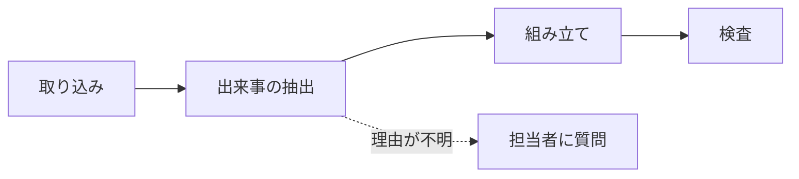

# AIとの壁打ち、その都度の検証と判断を説明できますか？

## 「で、なんでその方針にしたの?」に言葉を詰まらせた件

頼まれていたタスクの進捗を上司に報告した時のことです。

```
やったことを話す。
結論を話す。
「で、なんでその方針にしたの?」と聞かれる。
「えっと……」となる。
```

方針を決めた時、自分の中では納得していました。AIと何十往復もやり取りして、複数の案を比べて、理由があって選んだはずでした。ところが聞かれた瞬間、その理由が出てきません。捨てた案も、なぜ捨てたのかも、思い出せませんでした。

「ここまで進んだ」「今これをやっている」は話せる。でも「なぜそうしたのか」だけが抜けている。決めた時に納得したことと、後から説明できることは別物なのだと、上司の時間を奪いながら気づきました。

## 納得した記憶だけが残って、根拠は残らない

AIと一緒に仕事を進めると、思考は確かに早くなります。ただ、その速さの分だけ判断がチャットに埋もれていきます。

何十往復もした会話、要約してもらっても自分が納得した判断を掘り起こすことはありません。手元には「根拠を持って納得して決めた」という感覚だけ。記録をサボった、ではなく判断の妥当性が説明できない状況。

報告を受ける側には結論だけが届き、人の検証なのかAIの提案そのままなのかがわからない。

都度記録を残せば解決するのは分かっていて、でも記録をつける時間は減らしたい。その両方を解決する方法はないかを考えました。

## 作ったもの：AIとの会話を置くだけで、決定・理由・却下案が根拠つきで残る

作ったのは、プロジェクトを立ち上げて、そこにファイル(AIとのやり取り、メモ、資料など)を置いておくだけのツールです。

プロジェクト内にファイルが格納されると、AIがその中身を時系列も加味しながら読み解き、「何を決めたか」「その理由は何か」「進捗はどうか」「決定に至るまでの流れ」をまとめた資料を作ってくれます。

その後も1時間ごとにプロジェクトを確認し、決定などの記録が新しく増えていたときだけ、まとめ資料を作り直します。

ポイントは、利用者が新しく何かを書く必要がないことです。普段通りAIとやり取りしたログや、作業中に取ったメモを、そのままプロジェクトに置いておくだけで、あとはAI側が「これは決定事項」「これは却下案」「これはまだ未解決」と仕分けて、資料として組み立ててくれます。

決定の理由が見つからないときは、AIが前後の会話や過去の記録を調べ、それでも分からなければ登録した人に質問します（1回の実行で2問、1人1日3問まで）。回答は次の資料に理由として載ります。「人が発案」「AIの提案のまま」といった出どころの印は、AIが付けたものを発言者の目印でシステムが補正します。過去に却下した案と似た決定が出てくると警告を出し、しばらく記録が増えなければマネージャーに無進捗を知らせます。


## こだわった点：引用をLLMに書かせない

ただAIにログを渡して「まとめて」と指示するだけなら、既存のツールで十分だと思います。ですがそれらは、結論と元の発言が紐づいていません。後になって「なんでその判断にしたのか」と思考の過程を深掘りしたくなっても、その頃には自分でも忘れていて、要約にはその跡が残っていない。結局、長い会話ログを一から掘り返すしかなくなるのです。

なので、以下の点にはこだわりました。

- 資料中の主張には、根拠になった元テキストの箇所を機械的に紐づける(AIに引用文そのものを書かせず、番号だけを返させて、原文はシステム側が引く)
- 「決定/却下案/未解決」などの記録は追記だけで積み上がっていく形にし、前回の資料に含まれていた誤りを次の資料が引き継がない構造にする
- AIの提案をそのまま採用したのか、人が確認した上で採用したのかを区別して表示する
- 決定・却下案・未解決などを形と色で区別し、論点ごとの段に並べたタイムライン図を自動生成する。項目をクリックすると根拠の原文が表示されるので、「今どこまで進んでいるか」を図から一目で追える

「AIが要約してくれた簡潔な文章」ではなく、「後から突っ込まれても耐えられる、根拠つきの記録」を目指しました。

## 「セキュリティは大丈夫なの?」への答え

社内のやり取りやメモをAIに渡す以上、避けて通れない話です。結論から言うと、「AIに見せたくない情報」や「管理者しか見てはいけない情報」を、仕組みとして切り分けています。

- ソースごとに、AIの目に触れさせない除外設定ができます。除外したソースは、以後AIへの入力から外れます
- 管理者しか知るべきでない内容が含まれる時は、管理者限定の資料があるときは、全員向けとは別に管理者向けの版を作り、一般の立場の人には管理者向けの資料のデータ自体を渡しません
- データベースはSupabaseのRLS(行単位のアクセス制御)を有効にしています。ブラウザから直接データベースを読まれることはなく、権限の確認はサーバー側で行います
- ユーザーが貼り付けた会話やファイルの内容は、AIへの「指示」ではなく「読むだけの材料」として扱います。指示めいた一文は検出して画面で知らせ、その文だけを根拠にした記録は採用しません
- APIキーらしき文字列は、AIに渡す文字と保存する原文の両方で伏せ字にします（元のファイルは非公開の保存場所に置きます）

## 技術の話 — 資料ができるまでの4ステップ



1. 取り込み：アップロードされた会話やファイルから文字を取り出し、キーらしき文字列を伏せ字にしてから、発言や段落ごとに「S3-12」のような番号を振って保存します（末尾の注意書きを参照）。
2. 出来事の抽出：新しく増えた番号の範囲だけをLLMに読ませ、決定・却下案・未解決などを根拠の番号つきで記録します。記録は追記のみで、後から「いつ何が変わったか」を辿れるようにしています。新しい記録が無ければ、ここで終了です。
3. 組み立て：LLMには本文と根拠の番号だけを返させ、脚注の原文はシステムが引きます。LLMに引用を書かせると、原文と一字違う「それらしい引用」が混ざるためです。図も、文法エラーで消えないよう、LLMではなくシステムが記録から組み立てます。
4. 検査：存在しない番号を捨て、根拠の無い文には「根拠なし」と付けます。最後に別のモデルが、決定の具体性・理由・作業日記になっていないかを採点し、不合格なら定期実行では1回だけ作り直します。それでも通らなければ「要確認」にします。

---

なお、「置いておくだけ」と書いた取り込みは、今回は時間の関係で自動化を実装せず、アプリの画面から会話やファイルをアップロードする形式にしています。フォルダの監視やAIとの会話の自動記録は、今後の拡張として考えています。

本プロダクトは、[AI HACK](https://aihackathon.jp/)というハッカソンで、2人のチーム（非エンジニアと若手エンジニア）で4日間(2026/9/19〜9/22、発表9/23)かけて作ったプロダクトです。LLMゲートウェイには [OrcaRouter](https://www.orcarouter.ai/ja) のAPIを使用しています。
